# 컴퓨터비전 YOLO 조사

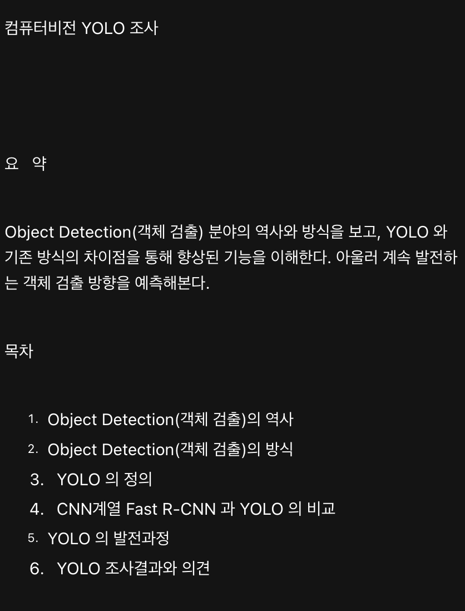

## 요약

Object Detection(객체 검출) 분야의 역사와 방식을 보고, YOLO 와 기존 방식의 차이점을 통해 향상된 기능을 이해한다. 아울러 계속 발전하는 객체 검출 방향을 예측해본다.

## 목차

1. Object Detection(객체 검출)의 역사
2. Object Detection(객체 검출)의 방식
3. YOLO 의 정의
4. CNN계열 Fast R-CNN 과 YOLO 의 비교
5. YOLO 의 발전과정
6. YOLO 조사결과와 의견

---

## 1. Object Detection(객체 검출)의 역사

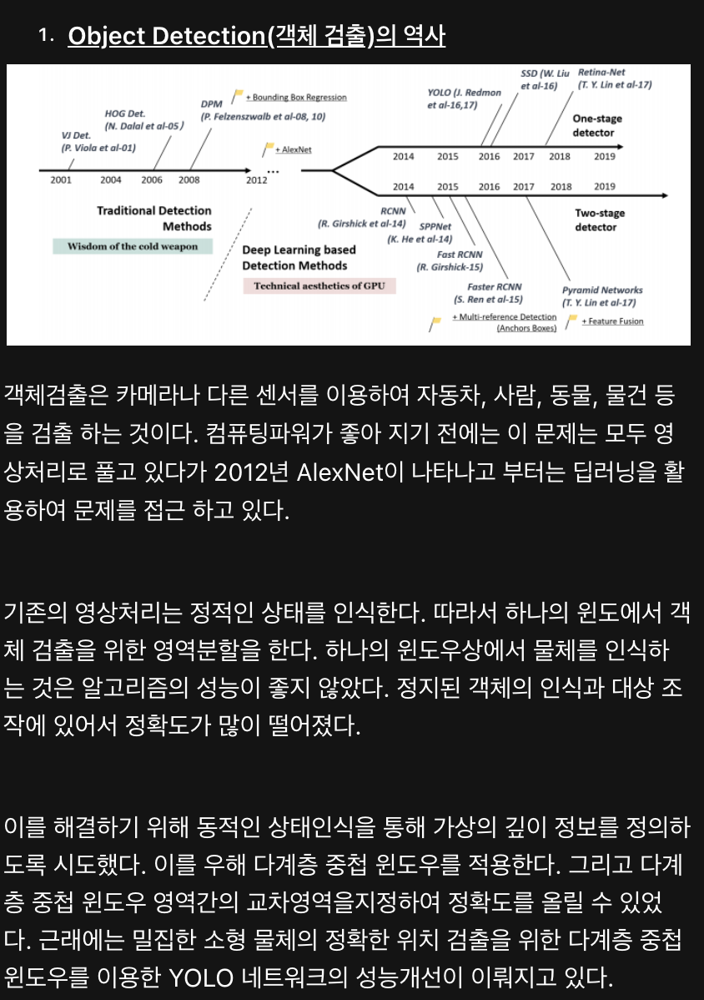

객체검출은 카메라나 다른 센서를 이용하여 자동차, 사람, 동물, 물건 등을 검출 하는 것이다. 컴퓨팅파워가 좋아 지기 전에는 이 문제는 모두 영상처리로 풀고 있다가 2012년 AlexNet이 나타나고 부터는 딥러닝을 활용하여 문제를 접근 하고 있다.

기존의 영상처리는 정적인 상태를 인식한다. 따라서 하나의 윈도에서 객체 검출을 위한 영역분할을 한다. 하나의 윈도우상에서 물체를 인식하는 것은 알고리즘의 성능이 좋지 않았다. 정지된 객체의 인식과 대상 조작에 있어서 정확도가 많이 떨어졌다.

이를 해결하기 위해 동적인 상태인식을 통해 가상의 깊이 정보를 정의하도록 시도했다. 이를 우해 다계층 중첩 윈도우를 적용한다. 그리고 다계층 중첩 윈도우 영역간의 교차영역을 지정하여 정확도를 올릴 수 있었다. 근래에는 밀집한 소형 물체의 정확한 위치 검출을 위한 다계층 중첩 윈도우를 이용한 YOLO 네트워크의 성능개선이 이뤄지고 있다.

## 2. Object Detection(객체 검출)의 방식

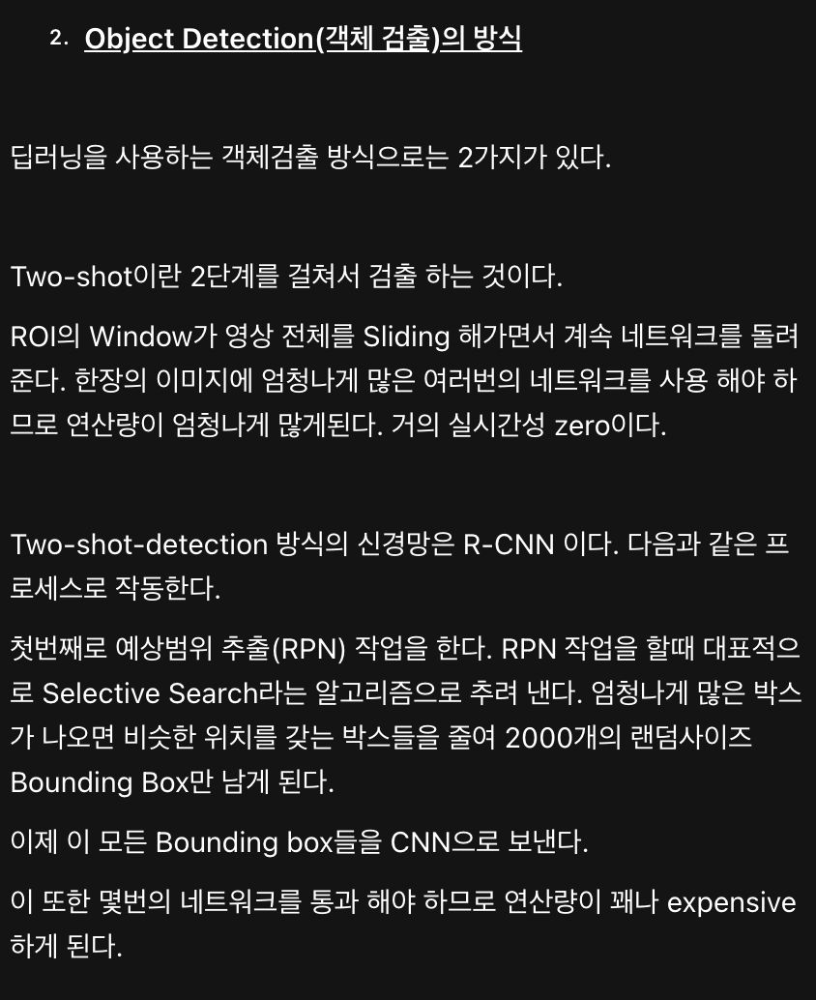

딥러닝을 사용하는 객체검출 방식으로는 2가지가 있다.

Two-shot이란 2단계를 걸쳐서 검출 하는 것이다.

ROI의 Window가 영상 전체를 Sliding 해가면서 계속 네트워크를 돌려준다. 한장의 이미지에 엄청나게 많은 여러번의 네트워크를 사용 해야 하므로 연산량이 엄청나게 많게된다. 거의 실시간성 zero이다.

Two-shot-detection 방식의 신경망은 R-CNN 이다. 다음과 같은 프로세스로 작동한다.

첫번째로 예상범위 추출(RPN) 작업을 한다. RPN 작업을 할때 대표적으로 Selective Search라는 알고리즘으로 추려 낸다. 엄청나게 많은 박스가 나오면 비슷한 위치를 갖는 박스들을 줄여 2000개의 랜덤사이즈 Bounding Box만 남게 된다.

이제 이 모든 Bounding box들을 CNN으로 보낸다.

이 또한 몇번의 네트워크를 통과 해야 하므로 연산량이 꽤나 expensive 하게 된다.

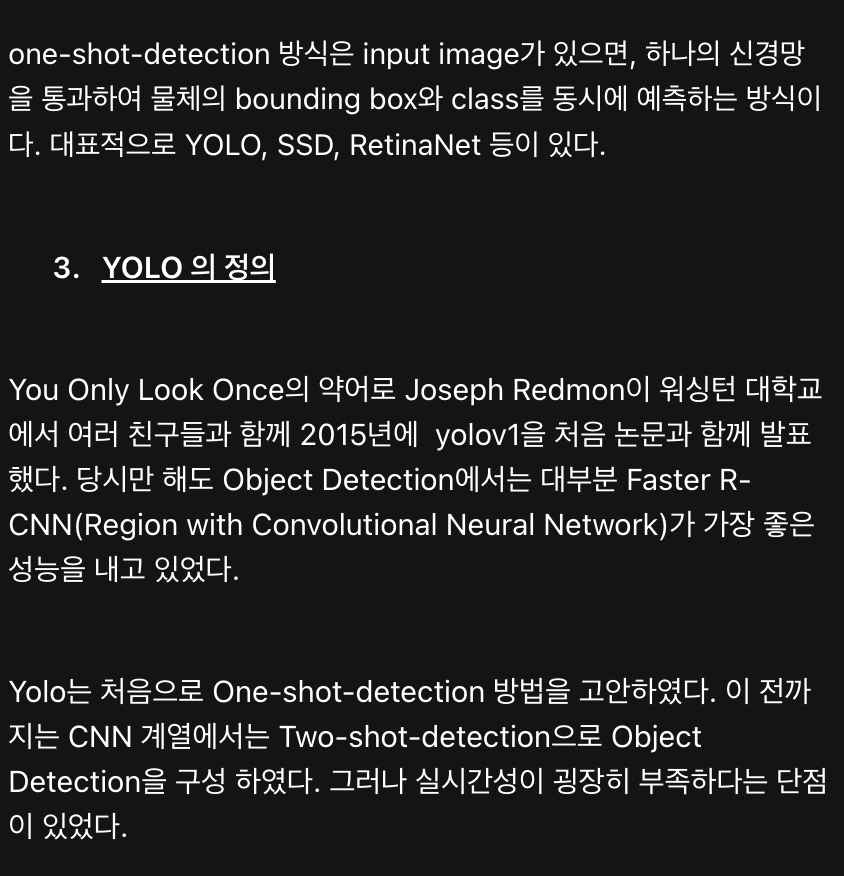

one-shot-detection 방식은 input image가 있으면, 하나의 신경망을 통과하여 물체의 bounding box와 class를 동시에 예측하는 방식이다. 대표적으로 YOLO, SSD, RetinaNet 등이 있다.

## 3. YOLO 의 정의

You Only Look Once의 약어로 Joseph Redmon이 워싱턴 대학교에서 여러 친구들과 함께 2015년에 yolov1을 처음 논문과 함께 발표했다. 당시만 해도 Object Detection에서는 대부분 Faster R-CNN(Region with Convolutional Neural Network)가 가장 좋은 성능을 내고 있었다.

Yolo는 처음으로 One-shot-detection 방법을 고안하였다. 이 전까지는 CNN 계열에서는 Two-shot-detection으로 Object Detection을 구성 하였다. 그러나 실시간성이 굉장히 부족하다는 단점이 있었다.

## 4. CNN계열 Fast R-CNN 과 YOLO 의 비교

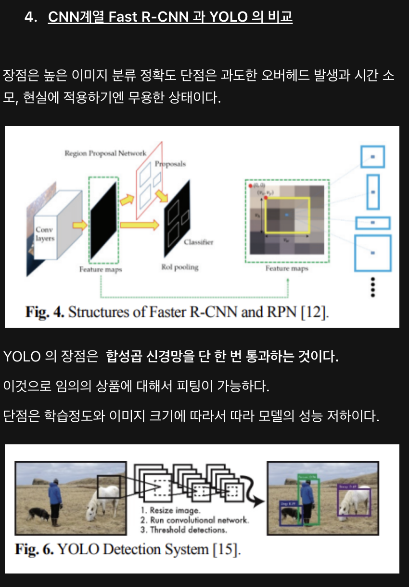

장점은 높은 이미지 분류 정확도 단점은 과도한 오버헤드 발생과 시간 소모, 현실에 적용하기엔 무용한 상태이다.

> Fig. 4. Structures of Faster R-CNN and RPN [12].

YOLO 의 장점은 합성곱 신경망을 단 한 번 통과하는 것이다.

이것으로 임의의 상품에 대해서 피팅이 가능하다.

단점은 학습정도와 이미지 크기에 따라서 따라 모델의 성능 저하이다.

> Fig. 6. YOLO Detection System [15].

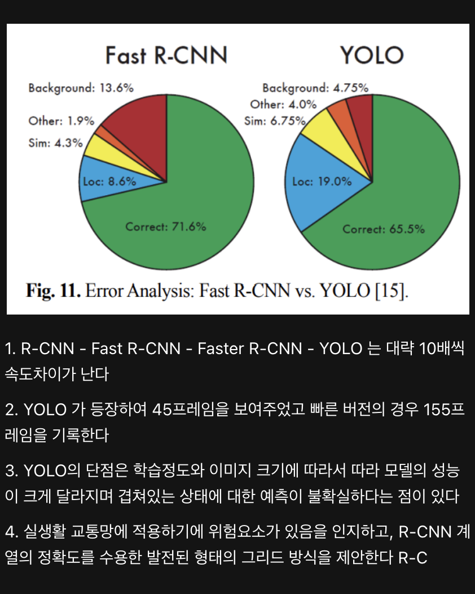

> Fig. 11. Error Analysis: Fast R-CNN vs. YOLO [15].

1. R-CNN - Fast R-CNN - Faster R-CNN - YOLO 는 대략 10배씩 속도차이가 난다
2. YOLO 가 등장하여 45프레임을 보여주었고 빠른 버전의 경우 155프레임을 기록한다
3. YOLO의 단점은 학습정도와 이미지 크기에 따라서 따라 모델의 성능이 크게 달라지며 겹쳐있는 상태에 대한 예측이 불확실하다는 점이 있다
4. 실생활 교통망에 적용하기에 위험요소가 있음을 인지하고, R-CNN 계열의 정확도를 수용한 발전된 형태의 그리드 방식을 제안한다 R-C

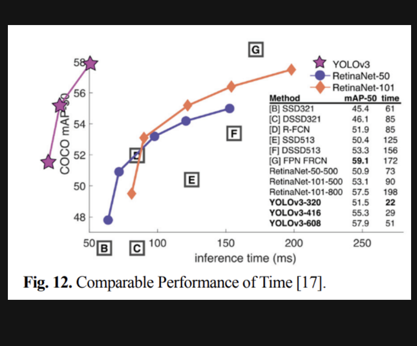

> Fig. 12. Comparable Performance of Time [17].

### 참고 - 보간(Interpolation) 예시 및 Segmentation 개념

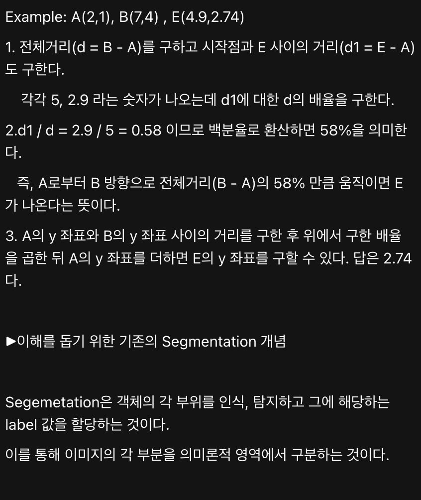

Example: A(2,1), B(7,4) , E(4.9,2.74)

1. 전체거리(d = B - A)를 구하고 시작점과 E 사이의 거리(d1 = E - A)도 구한다.

   각각 5, 2.9 라는 숫자가 나오는데 d1에 대한 d의 배율을 구한다.

2. d1 / d = 2.9 / 5 = 0.58 이므로 백분율로 환산하면 58%을 의미한다.

   즉, A로부터 B 방향으로 전체거리(B - A)의 58% 만큼 움직이면 E가 나온다는 뜻이다.

3. A의 y 좌표와 B의 y 좌표 사이의 거리를 구한 후 위에서 구한 배율을 곱한 뒤 A의 y 좌표를 더하면 E의 y 좌표를 구할 수 있다. 답은 2.74 다.

▶이해를 돕기 위한 기존의 Segmentation 개념

Segemetation은 객체의 각 부위를 인식, 탐지하고 그에 해당하는 label 값을 할당하는 것이다.

이를 통해 이미지의 각 부분을 의미론적 영역에서 구분하는 것이다.

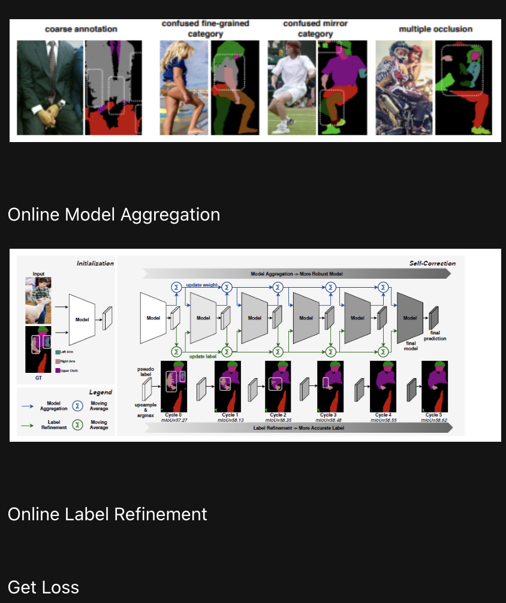

- coarse annotation / confused fine-grained category / confused mirror category / multiple occlusion 예시

**Online Model Aggregation**

**Online Label Refinement**

**Get Loss**

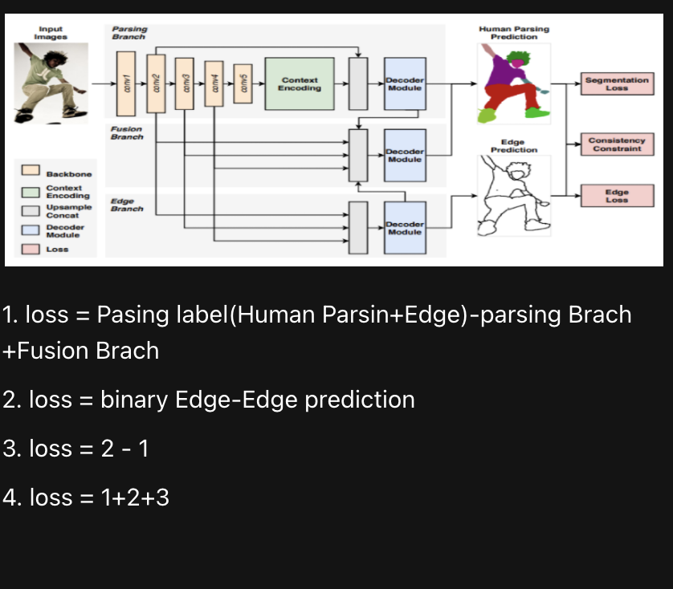

1. loss = Pasing label(Human Parsin+Edge)-parsing Brach +Fusion Brach
2. loss = binary Edge-Edge prediction
3. loss = 2 - 1
4. loss = 1+2+3

## 5. YOLO 의 발전과정

### YOLO v1

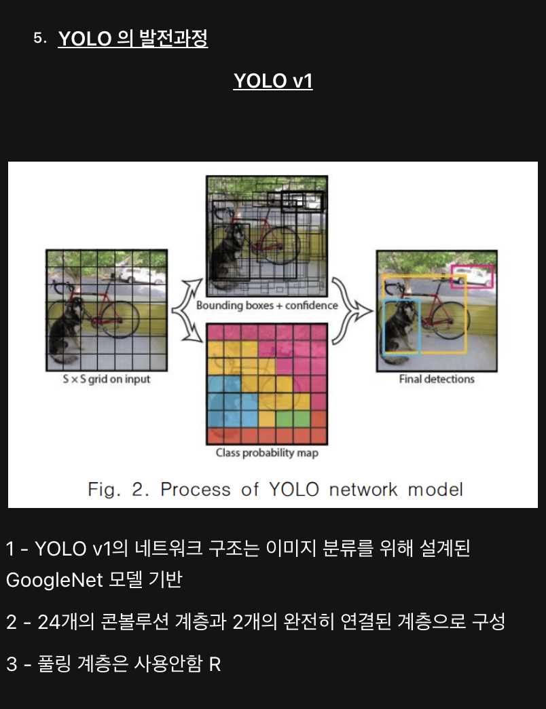

> Fig. 2. Process of YOLO network model

1. YOLO v1의 네트워크 구조는 이미지 분류를 위해 설계된 GoogleNet 모델 기반
2. 24개의 콘볼루션 계층과 2개의 완전히 연결된 계층으로 구성
3. 풀링 계층은 사용안함 R

### YOLO v2

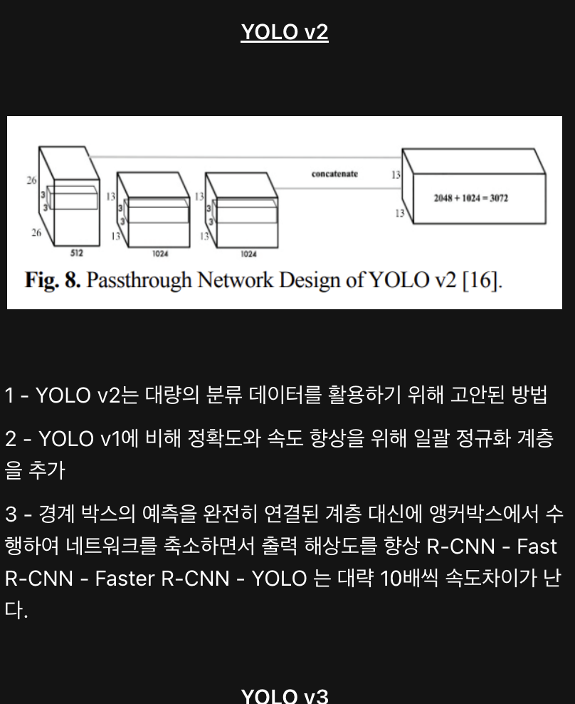

> Fig. 8. Passthrough Network Design of YOLO v2 [16].

1. YOLO v2는 대량의 분류 데이터를 활용하기 위해 고안된 방법
2. YOLO v1에 비해 정확도와 속도 향상을 위해 일괄 정규화 계층을 추가
3. 경계 박스의 예측을 완전히 연결된 계층 대신에 앵커박스에서 수행하여 네트워크를 축소하면서 출력 해상도를 향상 R-CNN - Fast R-CNN - Faster R-CNN - YOLO 는 대략 10배씩 속도차이가 난다.

### YOLO v3

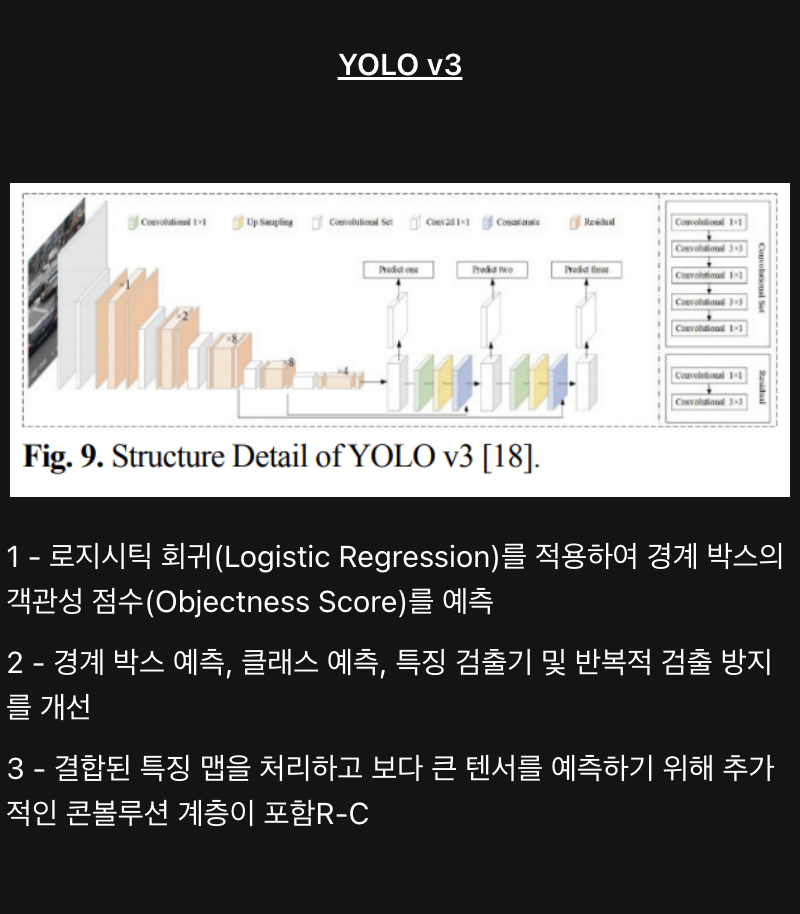

> Fig. 9. Structure Detail of YOLO v3 [18].

1. 로지시틱 회귀(Logistic Regression)를 적용하여 경계 박스의 객관성 점수(Objectness Score)를 예측
2. 경계 박스 예측, 클래스 예측, 특징 검출기 및 반복적 검출 방지를 개선
3. 결합된 특징 맵을 처리하고 보다 큰 텐서를 예측하기 위해 추가적인 콘볼루션 계층이 포함R-C

### YOLO v4

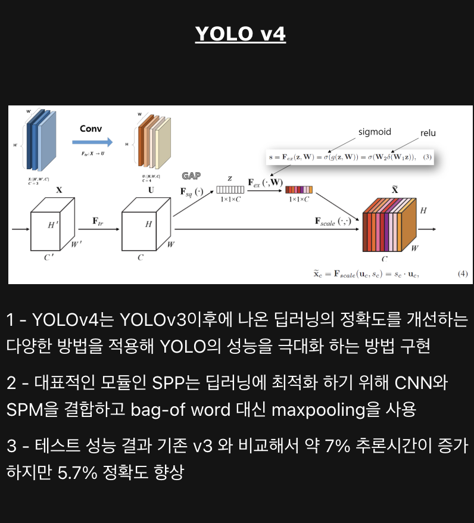

1. YOLOv4는 YOLOv3이후에 나온 딥러닝의 정확도를 개선하는 다양한 방법을 적용해 YOLO의 성능을 극대화 하는 방법 구현
2. 대표적인 모듈인 SPP는 딥러닝에 최적화 하기 위해 CNN와 SPM을 결합하고 bag-of word 대신 maxpooling을 사용
3. 테스트 성능 결과 기존 v3 와 비교해서 약 7% 추론시간이 증가하지만 5.7% 정확도 향상

### YOLO v5

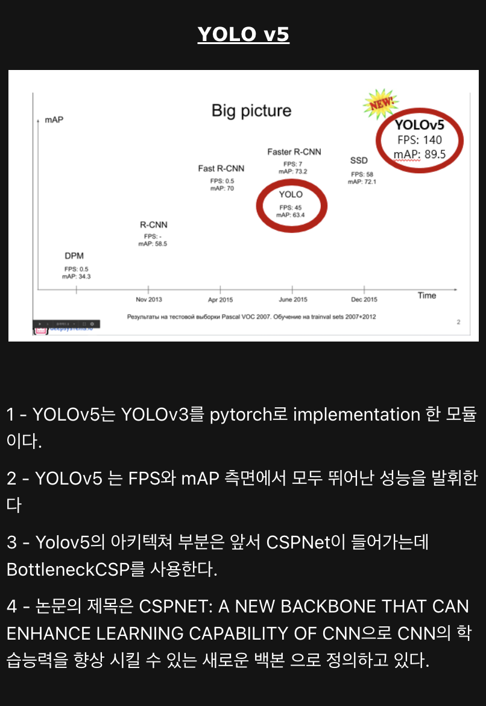

1. YOLOv5는 YOLOv3를 pytorch로 implementation 한 모듈이다.
2. YOLOv5 는 FPS와 mAP 측면에서 모두 뛰어난 성능을 발휘한다
3. Yolov5의 아키텍처 부분은 앞서 CSPNet이 들어가는데 BottleneckCSP를 사용한다.
4. 논문의 제목은 CSPNET: A NEW BACKBONE THAT CAN ENHANCE LEARNING CAPABILITY OF CNN으로 CNN의 학습능력을 향상 시킬 수 있는 새로운 백본 으로 정의하고 있다.

### 참고 - Feature Correlation / Bilinear Interpolation

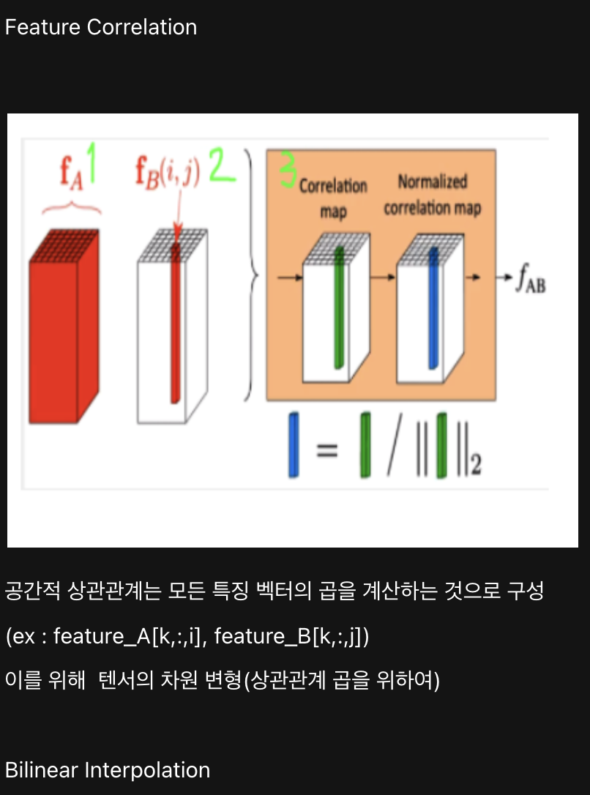

공간적 상관관계는 모든 특징 벡터의 곱을 계산하는 것으로 구성

(ex : feature_A[k,:,i], feature_B[k,:,j])

이를 위해 텐서의 차원 변형(상관관계 곱을 위하여)

**Bilinear Interpolation**

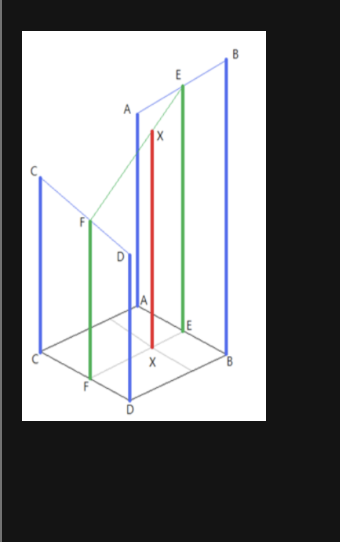

## 6. YOLO 조사결과와 의견

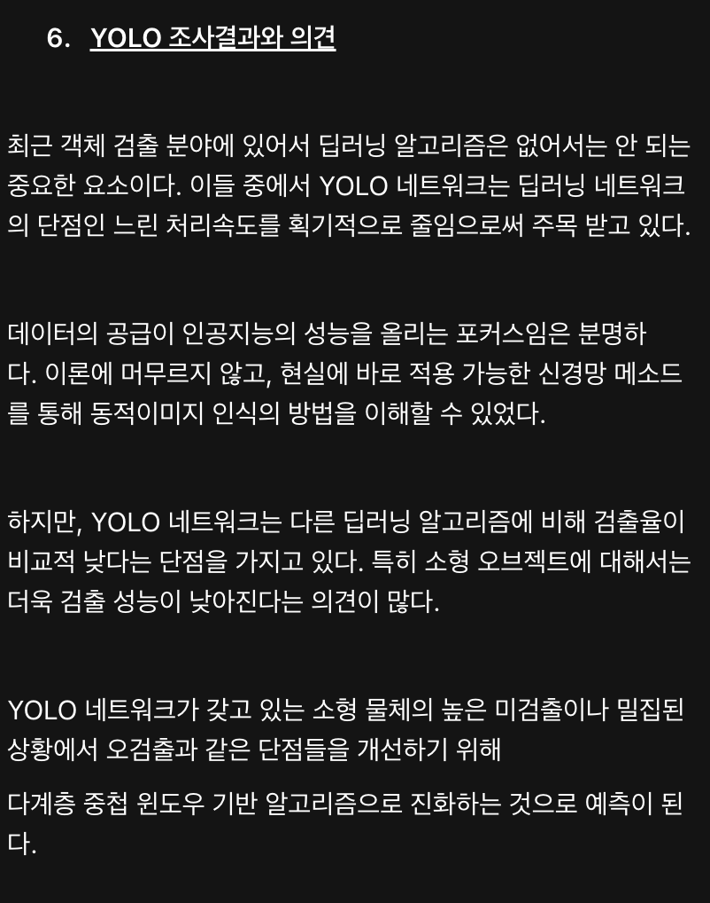

최근 객체 검출 분야에 있어서 딥러닝 알고리즘은 없어서는 안 되는 중요한 요소이다. 이들 중에서 YOLO 네트워크는 딥러닝 네트워크의 단점인 느린 처리속도를 획기적으로 줄임으로써 주목 받고 있다.

데이터의 공급이 인공지능의 성능을 올리는 포커스임은 분명하다. 이론에 머무르지 않고, 현실에 바로 적용 가능한 신경망 메소드를 통해 동적이미지 인식의 방법을 이해할 수 있었다.

하지만, YOLO 네트워크는 다른 딥러닝 알고리즘에 비해 검출율이 비교적 낮다는 단점을 가지고 있다. 특히 소형 오브젝트에 대해서는 더욱 검출 성능이 낮아진다는 의견이 많다.

YOLO 네트워크가 갖고 있는 소형 물체의 높은 미검출이나 밀집된 상황에서 오검출과 같은 단점들을 개선하기 위해

다계층 중첩 윈도우 기반 알고리즘으로 진화하는 것으로 예측이 된다.

## 참고문헌

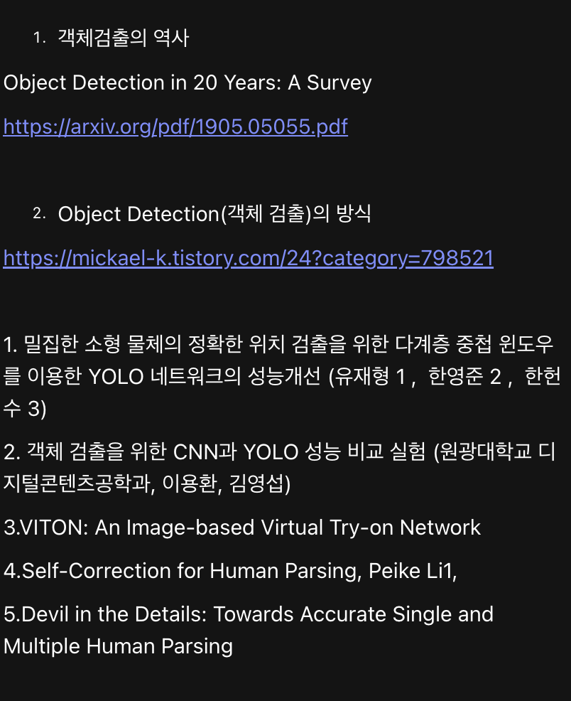

1. 객체검출의 역사

   Object Detection in 20 Years: A Survey
   https://arxiv.org/pdf/1905.05055.pdf

2. Object Detection(객체 검출)의 방식

   https://mickael-k.tistory.com/24?category=798521

1. 밀집한 소형 물체의 정확한 위치 검출을 위한 다계층 중첩 윈도우를 이용한 YOLO 네트워크의 성능개선 (유재형 1, 한영준 2, 한헌수 3)
2. 객체 검출을 위한 CNN과 YOLO 성능 비교 실험 (원광대학교 디지털콘텐츠공학과, 이용환, 김영섭)
3. VITON: An Image-based Virtual Try-on Network
4. Self-Correction for Human Parsing, Peike Li1,
5. Devil in the Details: Towards Accurate Single and Multiple Human Parsing
